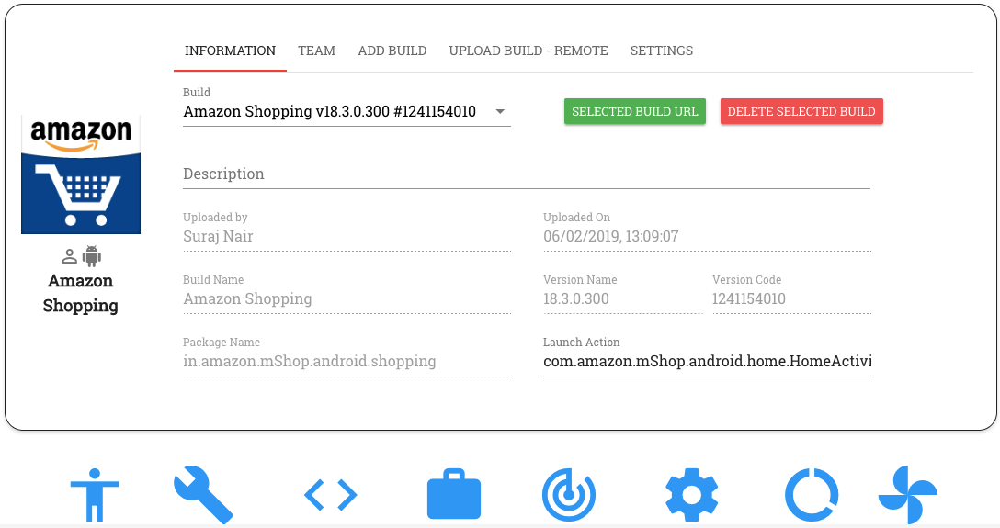

Project Dashboard
=================

The Project Dashboard is where 

----

After creating the project the user can proceed with the following actions like uploading the builds, adding team members to the project and adding jira settings.

The user can add more builds to the project and also has to provide a build description to uniquely identify build from other builds in the project.

Apps that are part of a particular project can be accessed by everyone who is part of that project.
Project members have the ability to test, automate and view reports for any build that is part of their project.

After user selecting the project, the user can select the appropriate build that he/she wish to test.
The user can select build from the build details section by selecting either the app name, version name or version code. The build description helps user to identify the right build.

If the user wishes to upload upload remotely, then he/she can upload build through postman calls.

The user can configure project with bug management settings. Right now we support Jira
