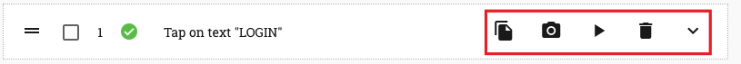
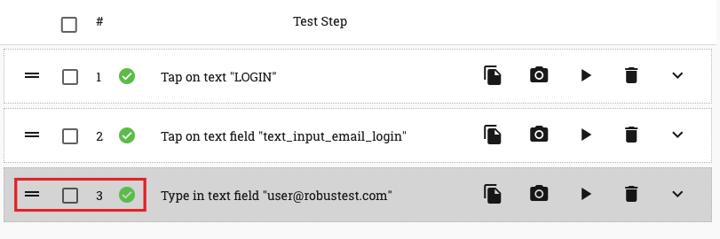

.. _teststep-management:

Test Step Management
====================

1. Create test step
2. Play Test steps - Run individual test steps, group play
3. Delete Test steps - Delete individual test steps, group delete
4. Copy Test steps
5. Rearrange test steps
6. Test Step Details 
   a. Basic 
   b. Settings
   c. User Data
   d. Return Data 
   e. XPath 
   f. Script 
   g. References 
   h. Dependencies
   i. Function Steps

For each action you record on the app, a corresponding test step is created in the 'test step table' to the right of the device screen

As you can see, RobusTest provides a default test step name for each test step by attempting to identify the user action. You can customise the name as required (more on this later).

Let's have a look at the different operations available to the user to perform on a test step

The icons to the right side of the test step relate to actions you can perform on that specific test step (see screenshot below)

* *Copy step* - this enables you to create a duplicate test step performing the same action as the original test step. This saves you time taken in re-recording the same test step , when you have to repeatedly perform the same action in the test case

* *Update Screenshot* - when you first record a test step, RobusTest captures a screenshot of the app page as it was at that moment. If you feel that this screenshot does not adequately represent the test step that was recorded (say, because the page took too long to load), then you can use the 'Update Screenshot' button to capture a new screenshot. 

The screenshot that is thus captured is displayed as the 'Original' screenshot in your run report when you execute the test case as part of a test run. 

* *Play step* - this enables you to execute the test step while in the Automation test session 

* *Delete step* - this enables you to delete the test step that you have recorded

* *Show step details*  - clicking on this expands the test step to reveal more options. You can know more by clicking on :ref:`test-step-details`

The icons to the left side of the test step relate to actions you can perform on one or more test steps (see screenshot below)

* *Re-arrange icon* - this icon helps in two ways: 
      a. By pressing and holding the mouse pointer over this icon and then dragging it, the user can re-arrange the position of this specific test step within the test case.

      b. By clicking on this icon, the user can pin the test step. This means that any new test step that is recorded will be positioned after the pinned test step.

Older text:

- - - - - - - - - -

Every action that you record on the app is added as a step in the test case table.
There are many useful option available as part of the Recording session.

1. If you wish to delete a step you can do that by clicking on the delete button.
2. If you wish to re-run a step or a group of steps, you can do that by selecting the steps and clicking on the Run Steps button in the header.
3. You can save your test case and continue the recording session. Once you have saved your test case, you could either update it or create a new one.
4. You can also edit the name of the test step to make it more intuitive.
5. An orange highlighter points to the location of the current execution pointer
6. The pin icon in the Action column enables user to select the current execution point

When a user clicks on a text field, the system shows a text box to enter the text value.
When user enters a value in the text box, this is recorded as an input value for the field.

After a test case has been created, click on the Save button to provide a name and save this test case. Click on End session to close the recording session without saving the test case.

Upon saving the test case, you will see your saved test case along with the actual test script and related information. There are four tabs on the test case page.

1. Test Step: This tab lists the steps of the test case
2. Test Script: This tab shows the test script to be executed when the automated test case runs. The script is shown in a smart script editor. If the user wishes to add custom code to his/her test scripts, s/he can do that in this script editor. The editor also checks for syntax correctness.
3. Meta Data: The test script has been designed in a modular way to separate the app objects from the test script. This ensures that the test case can be easily updated and maintained as builds change over time.
4. User Data: In line with the modular design, the user data too is separated out from the test script and is available in the User Data tab.

- - - - - - - - - - 

